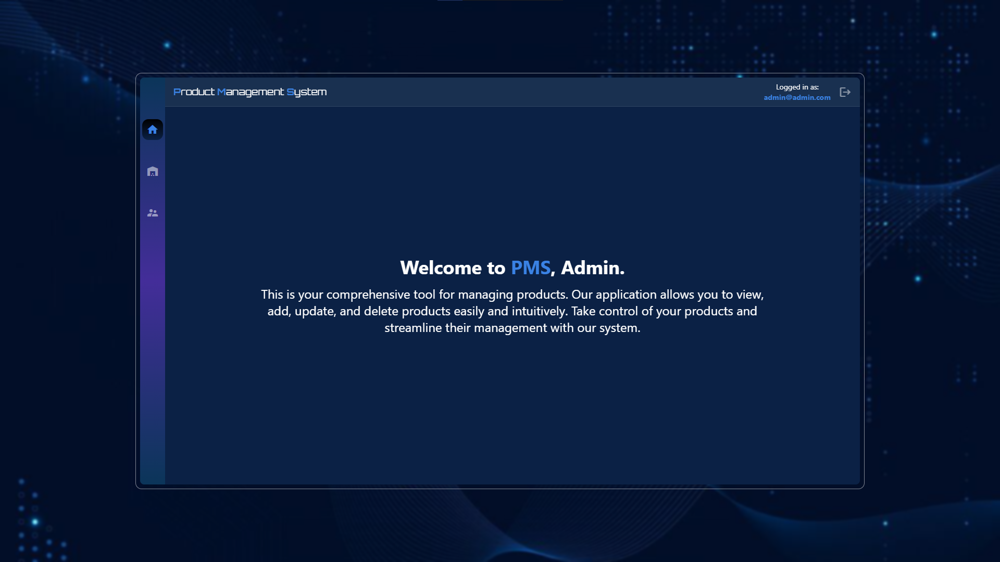
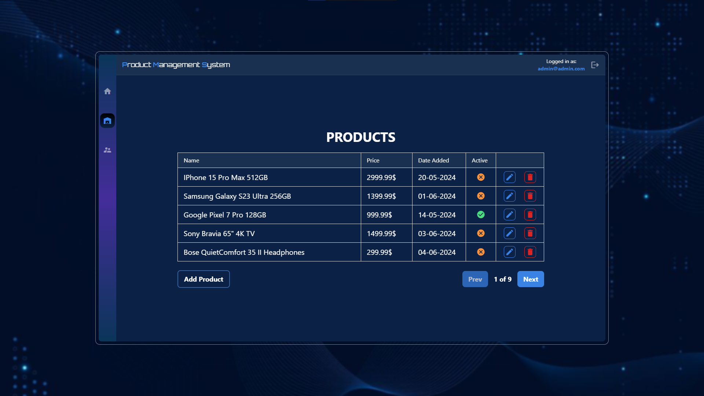
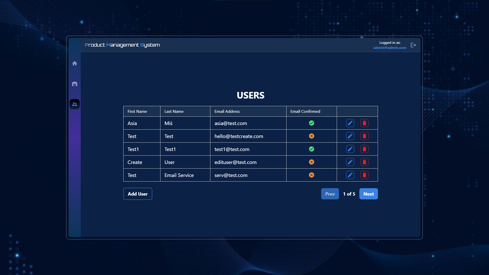

# Product Management Systen

<p>Application where users can view, create, update and delete products of their choice. Users can sign in, create account, confirm email to be able to sign in and reset their password. Furthermore, there is one admin account with Admin role, which lets him create, update and delete other users.</p>

## 📸 Screenshots

<div>
<h3>Desktop</h3>




</div>

## 🧐 Features

Here're some of the project's best features:

- CRUD for Products and Users
- Role-based authorization
- Pagination for both tables
- Email confirmation service
- Password recovery service
- User-Friendly error and loading handling

## 🛠️ Installation Steps:

1. You have to install **Papercut SMTP** to be able to receive emails.

- Download: https://github.com/ChangemakerStudios/Papercut-SMTP/releases

2. Go to **appsettings.json** and replace **ConnectionString:Default** with your connection string.

```appsettings.json
"ConnectionStrings": {
"Default": "your_connection_string"
}
```

Or configure **user-secrets** with the same keys.

```powershell
cd API
dotnet user-secrets init
dotnet user-secrets set "KEY" "VALUE"
```

NOTE: For Papercut SMTP, "SmtpServer" is **localhost** and Port is **25**.

3. In **Program.cs** change DbContext options to your Database Provider

```Program.cs
builder.Services.AddDbContext(options =>
{
options.YOUR_DATABASE(builder.Configuration.GetConnectionString("Default"));
});
```

4. Open **NuGet Package Manager Console** and run:

```
Add-Migration Initial
Update-Database
```

5. In UI folder go to **config** folder and change url:

```config.ts
export const url = 'https://localhost:{your_port}/api/';
```

6. In UI folder run:

```
npm install
```

## 💻 Built with

- Angular
- TypeScript
- ASP.NET Core
- Entity Framwork Core
- PostgreSQL
- Angular Material
- TailwindCSS
- ASP.NET Identity

## 🧠 What I've learned

- Fluently creating API endpoints for account management
- Creating Email Service, how Email Confirmation and Password Recovery works with it
- Using Angular Route Guards to protect pages from unauthorized users
- Using FluentAPI to configure model column's properties
